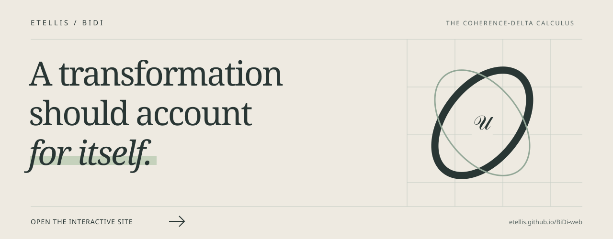

<h1 align="center">BiDi</h1>

<strong>Universal Operator System</strong> Source, state, and evidence in one accountable path.

<a href="https://etellis.github.io/BiDi-web/">Explore the interactive site ↗</a> · <a href="paper/main.pdf">Read the paper</a> · <a href="https://etellis.github.io/U-web/">See U</a>

BiDi connects formal source, executable state, and evidence through the Coherence-Delta Calculus. Its finite reductions describe how phases evolve, when observation may commit, and how belief and prior move between levels. U1 guards a path before effects are enacted. U2 differentiates an accepted path and asks whether its complete state returns before granting return analysis.

An endpoint can look familiar while the actual state has changed. An angle may wrap around; a latch, belief, prior, or unwrapped phase may not. A derivative along the path can still be useful even when recurrence fails. BiDi records what was established and keeps a later conclusion on hold until its conditions are met.

The interactive instrument lets you adjust four phases, advance synchronous flow, quantize observations, and attempt a commit. A commit is permitted only when **every running sum** of its ordered ternary observations stays nonnegative. The final sum need not be zero. That decision is written in [U](model.u), compiled to [WebAssembly](model.wasm), and exercised on all 81 four-trit combinations. The [binary receipt](model.wasm.json) records the contract and checksum. An unavailable module leaves the decision unavailable, and a held commit leaves existing latches intact.

The displayed flow and quantization are browser calculations under the shown equations. The compiled U module checks the resulting trits. The page gives you a way to feel the prefix barrier; it does not issue a native CDC or U1/U2 receipt.

The [research preprint](paper/main.pdf) develops the finite state reduction, guarded path analysis, recurrence, and return operator in their mathematical scope. The [arXiv source bundle](paper/arxiv-source.zip) is available for inspection. The manuscript has not been submitted or peer reviewed. Its equations and the native system make different kinds of claims, so each result carries its method and conditions.

BiDi predates [U](https://etellis.github.io/U-web/). U develops a wider language from this concrete source and evidence discipline while CDC keeps its own identity. The [BiDi implementation repository](https://github.com/ETEllis/BiDi) contains the grammar, runtime, source fixtures, verification matrix, and formal work. It is access-controlled; this site and paper are public.
